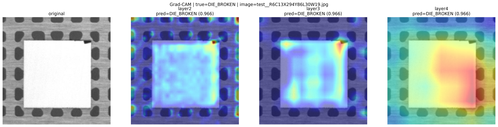
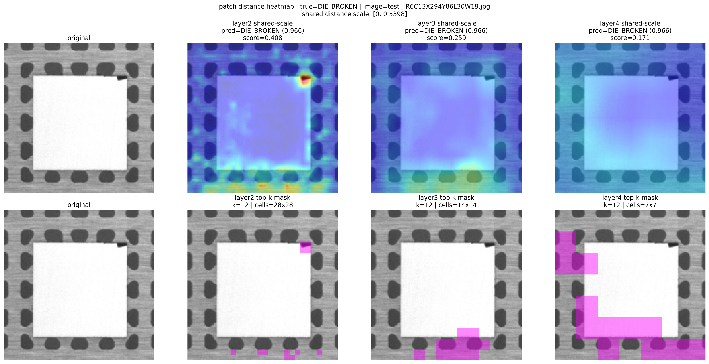
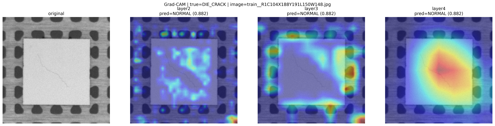
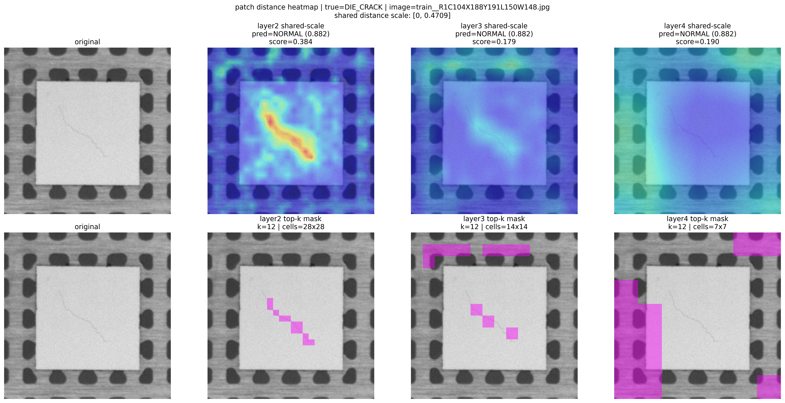
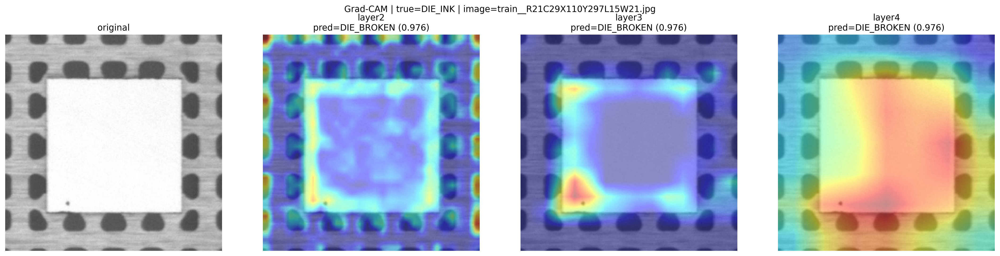
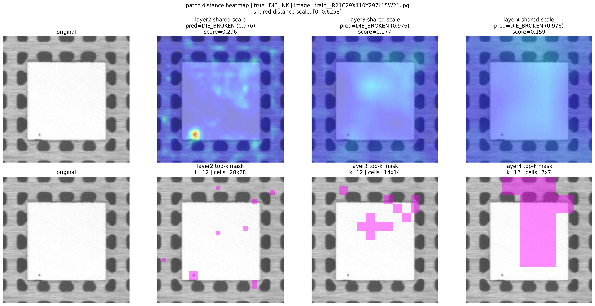
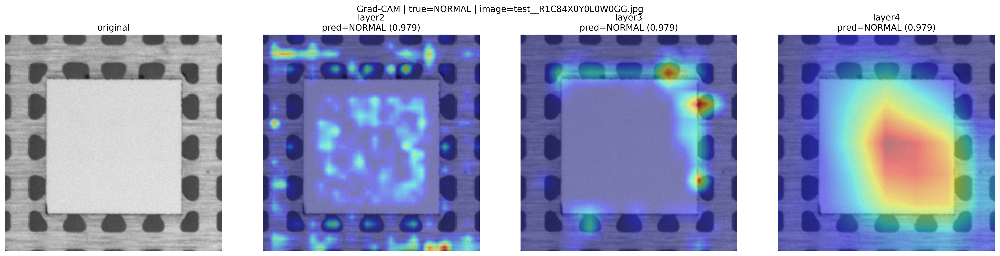
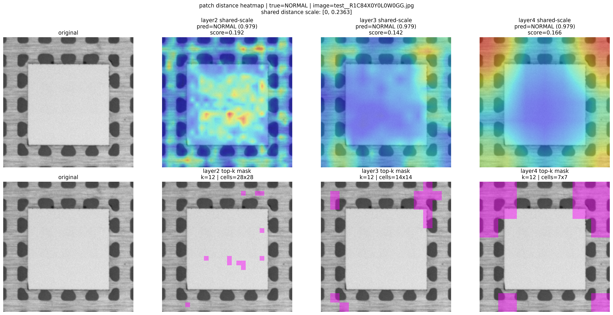
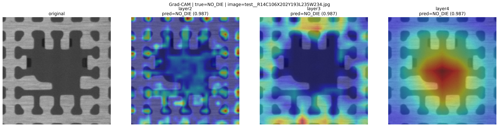
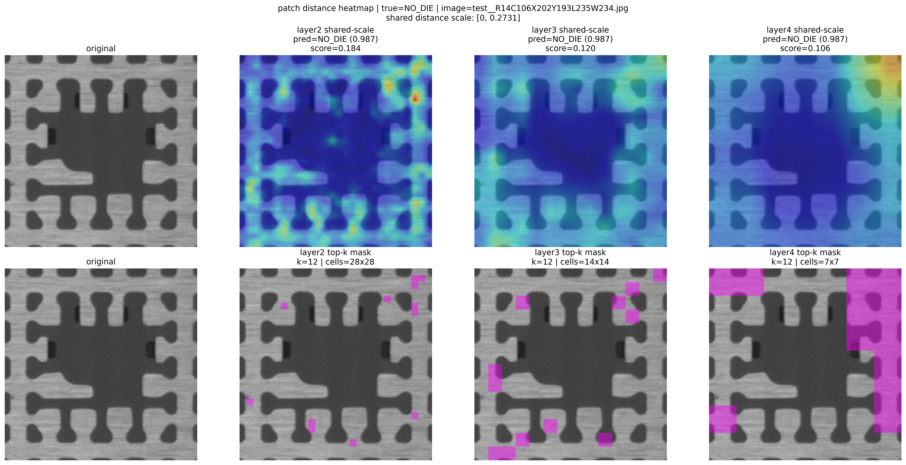

# Ablation Study

기준 checkpoint:

- [fs_r3_ac17_sharp110_p20_seed61](../best_run/resnet18_best_val_loss_epoch29.pth)

공통 평가 조건:

- `val`에서 threshold 선택
- `test`는 고정 threshold 평가
- metric:
  - `open_macro_f1`
  - `overall_acc`
  - `known_acc`
  - `unknown_acc`

원본 집계 파일:

- [ablation_metrics.json](ablation_metrics.json)

## 1. Open-Set Method Ablation

같은 best checkpoint에 대해 open-set 방법만 바꿔 비교했다.

| Method | Threshold Type | Open macro F1 | Overall acc | Known acc | Unknown acc |
| --- | --- | ---: | ---: | ---: | ---: |
| `baseline` | none | 0.5167 | 0.4533 | 0.9714 | 0.0000 |
| `softmax threshold` | global | 0.6654 | 0.6533 | 0.5143 | 0.7750 |
| `softmax threshold` | class-wise | 0.6218 | 0.5467 | 0.9429 | 0.2000 |
| `feature distance` | global | 0.7453 | 0.7200 | 0.6857 | 0.7500 |
| `feature distance` | class-wise | 0.6594 | 0.6933 | 0.5714 | 0.8000 |
| `patch-based feature distance` | global | **0.8447** | **0.8667** | 0.8000 | **0.9250** |
| `patch-based feature distance` | class-wise | 0.8294 | 0.8533 | 0.8000 | 0.9000 |

추가 참고:

- `softmax threshold [class-wise]`는 joint grid search를 사용했고, 계산량 때문에 `30-step` grid로 탐색했다.
- `feature distance [class-wise]`와 `patch-based feature distance [class-wise]`는 현재 구현상 independent class-wise threshold다.

해석:

- `baseline`은 known 분류는 매우 좋지만 unknown reject가 전혀 안 된다.
- `softmax threshold`는 confidence 기반이라 known/unknown 분리가 불안정하다.
  - global은 unknown은 어느 정도 거르지만 known 손실이 크다.
  - class-wise는 known 보존은 좋지만 unknown recall이 크게 떨어진다.
- `feature distance`는 softmax threshold보다 분명히 낫지만, best checkpoint 기준으로는 still patch-based보다 약하다.
- `patch-based feature distance [global]`가 전체 방법 중 가장 좋았다.
  - `open_macro_f1=0.8447`
  - `overall_acc=0.8667`
  - `unknown_acc=0.9250`

## 2. Layer 2~4 Difference

비교 기준:

- 방법: `patch-based feature distance [global]`
- pooling: `topk=12`
- normalization: predicted-class z-score from `train known`
- threshold: `val open_macro_f1` 기준 선택

| Layer | Threshold | Open macro F1 | Overall acc | Known acc | Unknown acc |
| --- | ---: | ---: | ---: | ---: | ---: |
| `layer2` | 0.098085 | **0.8447** | **0.8667** | 0.8000 | **0.9250** |
| `layer3` | 0.284295 | 0.6623 | 0.6400 | 0.7429 | 0.5500 |
| `layer4` | 0.881871 | 0.6626 | 0.6133 | 0.8857 | 0.3750 |

해석:

- `layer2`가 압도적으로 가장 좋다.
- `layer3`, `layer4`는 known feature는 어느 정도 유지되지만 unknown 분리력이 크게 떨어진다.
- 특히 `layer4`는 known 보존은 높아도 unknown recall이 너무 낮다.
- 현재 데이터에서는 spatial detail이 더 살아 있는 `layer2`가 open-set patch scoring에 가장 적합했다.

### Layer Heatmap Examples

같은 best checkpoint에 대해, 동일 이미지에서 `layer2/3/4` patch-distance map을 원본 위에 overlay했다.

5개 클래스 대표 예시:

- `DIE_BROKEN`
  - [overlay png](class_by_image_seed61/DIE_BROKEN/test__R6C13X294Y86L30W19/resnet18_best_val_loss_epoch29_test__R6C13X294Y86L30W19_patch_distance_layers234.png)
  - [metadata json](class_by_image_seed61/DIE_BROKEN/test__R6C13X294Y86L30W19/resnet18_best_val_loss_epoch29_test__R6C13X294Y86L30W19_patch_distance_layers234.json)
- `DIE_CRACK`
  - [overlay png](class_by_image_seed61/DIE_CRACK/train__R1C104X188Y191L150W148/resnet18_best_val_loss_epoch29_train__R1C104X188Y191L150W148_patch_distance_layers234.png)
  - [metadata json](class_by_image_seed61/DIE_CRACK/train__R1C104X188Y191L150W148/resnet18_best_val_loss_epoch29_train__R1C104X188Y191L150W148_patch_distance_layers234.json)
- `DIE_INK`
  - [overlay png](class_by_image_seed61/DIE_INK/train__R21C29X110Y297L15W21/resnet18_best_val_loss_epoch29_train__R21C29X110Y297L15W21_patch_distance_layers234.png)
  - [metadata json](class_by_image_seed61/DIE_INK/train__R21C29X110Y297L15W21/resnet18_best_val_loss_epoch29_train__R21C29X110Y297L15W21_patch_distance_layers234.json)
- `NORMAL`
  - [overlay png](class_by_image_seed61/NORMAL/test__R1C84X0Y0L0W0GG/resnet18_best_val_loss_epoch29_test__R1C84X0Y0L0W0GG_patch_distance_layers234.png)
  - [metadata json](class_by_image_seed61/NORMAL/test__R1C84X0Y0L0W0GG/resnet18_best_val_loss_epoch29_test__R1C84X0Y0L0W0GG_patch_distance_layers234.json)
- `NO_DIE`
  - [overlay png](class_by_image_seed61/NO_DIE/test__R14C106X202Y193L235W234/resnet18_best_val_loss_epoch29_test__R14C106X202Y193L235W234_patch_distance_layers234.png)
  - [metadata json](class_by_image_seed61/NO_DIE/test__R14C106X202Y193L235W234/resnet18_best_val_loss_epoch29_test__R14C106X202Y193L235W234_patch_distance_layers234.json)

읽는 방법:

- 붉을수록 prototype과의 patch distance가 큰 위치다.
- unknown 예시(`DIE_CRACK`, `DIE_INK`)에서는 `layer2`가 가장 국소적이고 강한 anomaly response를 보이고,
  `layer3/4`로 갈수록 spatial detail이 줄어드는 경향을 볼 수 있다.
- known 예시(`DIE_BROKEN`, `NORMAL`, `NO_DIE`)에서는 전반적으로 heatmap이 더 고르게 낮고, `layer2`에서도 과도한 hotspot이 적다.

## 2.5. Grad-CAM vs Patch-Distance

두 시각화는 같은 이미지에 대해 만들었지만 의미가 다르다.

- `Grad-CAM`
  - `softmax argmax`로 선택된 known class를 만들 때 모델이 어디를 근거로 봤는지 보여준다.
  - 즉 open-set reject 이전의 `classifier decision evidence`다.
- `patch-distance`
  - 같은 이미지를, 예측된 class의 `layer2/3/4 prototype map`과 비교해서 어디가 많이 다른지 보여준다.
  - 즉 open-set scoring에 들어가는 `prototype mismatch`다.

정리하면:

- `Grad-CAM`: 왜 그 known class로 분류했는가
- `patch-distance`: 그 예측 class prototype과 어디가 어긋나는가

현재 예시 5장은 representative sample 기준으로 만들었고, known 3개는 맞춘 케이스, unknown 2개는 known으로 잘못 분류된 케이스다.

| True class | Raw argmax pred | Correct? |
| --- | --- | --- |
| `DIE_BROKEN` | `DIE_BROKEN` | yes |
| `DIE_CRACK` | `NORMAL` | no |
| `DIE_INK` | `DIE_BROKEN` | no |
| `NORMAL` | `NORMAL` | yes |
| `NO_DIE` | `NO_DIE` | yes |

### Visual Examples

#### DIE_BROKEN (`KNOWN`)

Raw classifier prediction: `DIE_BROKEN`

해석:

- `KNOWN`의 correct case다.
- `Grad-CAM`은 모델이 `DIE_BROKEN`로 판단할 때 실제 결함/패턴 근처를 근거로 봤는지 확인하는 용도다.
- `patch-distance`는 같은 위치에서 prototype과 얼마나 다른지 본다.
- known 정답 케이스에서는 `Grad-CAM`이 의미 있는 위치를 보고, `patch-distance`의 shared-scale 강도와 top-k mask가 unknown보다 상대적으로 덜 공격적이면 자연스럽다.

#### DIE_CRACK (`UNKNOWN`)

Raw classifier prediction: `NORMAL`

해석:

- `UNKNOWN`인데 raw classifier는 `NORMAL`로 잘못 본 case다.
- `Grad-CAM`은 왜 `NORMAL`로 착각했는지, 어떤 위치를 known evidence로 사용했는지 보여준다.
- 하지만 `patch-distance`에서는 같은 이미지가 `NORMAL prototype`과 꽤 다르다는 점이 드러나야 한다.
- 특히 아래 `top-k mask`는 최종 anomaly score를 만든 patch들이므로, 이 위치들이 open-set reject의 직접 근거다.

#### DIE_INK (`UNKNOWN`)

Raw classifier prediction: `DIE_BROKEN`

해석:

- `UNKNOWN`인데 raw classifier는 `DIE_BROKEN`으로 잘못 본 case다.
- `Grad-CAM`만 보면 known class처럼 보일 수 있지만, 그건 어디를 보고 `DIE_BROKEN`라 판단했는지일 뿐이다.
- 실제 open-set 판단은 `patch-distance`가 담당하고, shared-scale heatmap과 top-k mask가 `DIE_BROKEN prototype`과의 mismatch 위치를 보여준다.
- 따라서 unknown 예시는 `Grad-CAM`만으로 보면 애매할 수 있고, 반드시 `patch-distance`와 같이 읽어야 한다.

#### NORMAL (`KNOWN`)

Raw classifier prediction: `NORMAL`

해석:

- `KNOWN`의 correct case다.
- `Grad-CAM`은 `NORMAL` 판정을 만든 위치를 보여주고, `patch-distance`는 그 위치들이 `NORMAL prototype`과 대체로 잘 맞는지 확인하게 해준다.
- known 예시에서는 일부 hotspot이 있어도 이상하지 않다.
- 중요한 건 unknown 예시와 비교했을 때 top-k 위치가 덜 공격적이고, shared-scale에서 mismatch가 상대적으로 약한지다.

#### NO_DIE (`KNOWN`)

Raw classifier prediction: `NO_DIE`

해석:

- `KNOWN`의 correct case다.
- `NO_DIE`는 구조적으로 단순한 편이라, `Grad-CAM`이 비교적 안정적으로 특정 영역을 볼 수 있다.
- `patch-distance`도 top-k 위치가 있더라도 unknown처럼 강한 mismatch로 보이지 않는지 확인하면 된다.

읽는 포인트:

- `KNOWN` vs `UNKNOWN`을 먼저 구분해서 본다.
- `KNOWN` 샘플에서는 `Grad-CAM`이 실제 class evidence를 본 뒤, `patch-distance`도 상대적으로 낮고 안정적으로 나온다.
- `UNKNOWN` 샘플에서는 `Grad-CAM`이 known class 근거를 어느 정도 잡더라도, 같은 위치나 주변에서 `patch-distance`가 크게 올라간다.
- 위쪽 `shared-scale heatmap`은 layer 간 distance 강도를 공통 기준으로 비교하는 용도다.
- 아래쪽 `top-k mask`는 최종 anomaly score에 실제로 들어간 patch 위치만 보여준다.
- 따라서 최종 open-set 방법론은:
  - `classifier가 known class를 어떻게 골랐는지`는 `Grad-CAM`
  - `그 예측이 prototype 기준으로 얼마나 수상한지`는 `patch-distance`
  로 나눠 해석하면 된다.

## 3. Augmentation Ablation

비교 기준:

- open-set 방법은 전부 동일
  - `layer2 patch distance`
  - `topk=12`
  - z-score from `train known`
  - `val` threshold, `test` fixed

| Experiment | Augmentation | Best epoch | Best val loss | Open macro F1 | Overall acc | Known acc | Unknown acc |
| --- | --- | ---: | ---: | ---: | ---: | ---: | ---: |
| `no_aug` | 없음 | 15 | 0.2162 | 0.7480 | 0.7200 | 0.8000 | 0.6500 |
| `v2_aug_cs_mild` | mild contrast + sharpness | 29 | 0.2173 | 0.8347 | 0.8533 | 0.7714 | 0.9250 |
| `v2_aug_cs_autocontrast` | mild + autocontrast 0.50 | 18 | 0.2185 | 0.8294 | 0.8533 | 0.8000 | 0.9000 |
| `fine_search_best` | contrast 0.08 + sharpness 1.10/0.20 + autocontrast 0.17 | 29 | 0.2158 | **0.8447** | **0.8667** | 0.8000 | **0.9250** |

해석:

- augmentation은 분명히 효과가 있다.
- `no_aug` 대비 `fine_search_best`는:
  - `open_macro_f1`: `0.7480 -> 0.8447`
  - `overall_acc`: `0.7200 -> 0.8667`
  - `unknown_acc`: `0.6500 -> 0.9250`
- 강한 autocontrast(`0.50`)도 나쁘지 않았지만, 미세 탐색으로 찾은 약한 autocontrast(`0.17`)가 더 좋았다.
- 최종적으로는:
  - strong augmentation이 아니라
  - `mild` 기반 + 약한 `autocontrast` + 약한 `sharpness`
  가 가장 안정적이었다.

## Conclusion

- 방법론 ablation:
  - `patch-based feature distance [global]`가 최고
- layer ablation:
  - `layer2`가 최고
- augmentation ablation:
  - augmentation이 없는 것보다 있는 것이 확실히 낫고,
  - 최종 best는 `rotation=5`, `contrast=0.08`, `sharpness_factor=1.10`, `sharpness_p=0.20`, `autocontrast_p=0.17`

즉 현재 최종 best 모델은 아래 조합으로 정리할 수 있다.

- backbone: `ResNet18`
- training: `batch_size=8`, `epochs=30`, `label_smoothing=0.05`
- augmentation: `mild + weak autocontrast`
- open-set: `layer2 patch-based feature distance [global]`
